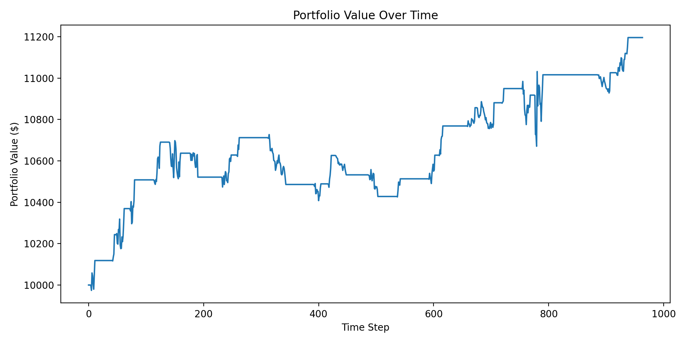

# Mean Reversion Trading Strategy (Z-Score Based)

## Overview

This project implements a long/short mean reversion trading strategy using Z-scores on SPY price data. The strategy identifies short-term deviations from a rolling average and trades on the expectation that prices will partially revert toward the mean.

The repository includes:

- A modular backtesting engine
- Long and short trading logic
- Risk management and performance metrics
- Live paper trading integration using Alpaca
- Clean, extensible architecture for further strategy development

---

## Strategy Logic

The strategy computes the Z-score of the current price relative to a rolling lookback window:

```text
z = (price - rolling mean) / rolling standard deviation
```

Trading rules:

- **Long entry:** `z < -2.0`  
  Price is significantly below its rolling mean, so the strategy buys.

- **Long exit:** `z >= -0.5`  
  Price has partially reverted toward the mean, so the strategy sells the long position.

- **Short entry:** `z > 2.0`  
  Price is significantly above its rolling mean, so the strategy sells short.

- **Short exit / cover:** `z <= 0.5`  
  Price has reverted to the mean, so the strategy buys to cover the short position.

---

## Parameters

| Parameter | Value |
|---|---:|
| Symbol | SPY |
| Lookback Window | 40 periods |
| Long Entry Threshold | `z < -2.0` |
| Long Exit Threshold | `z >= -0.75` |
| Short Entry Threshold | `z > 2.25` |
| Short Exit Threshold | `z <= 0.0` |
| Live Dollar Position | `$1000` per new live trade|

> Note: Parameters were selected to balance trade frequency, drawdown, and risk-adjusted returns. Further optimization and walk-forward testing would be needed before using this strategy with real capital.

---

## Backtest Results

Using historical SPY data, the strategy produced the following sample results:

```text
cumulative_return: 0.1196
sharpe_ratio: 0.8058
max_drawdown: -0.0297
volatility: 0.0376
win_rate: 0.7241
num_trades: 29

Initial portfolio value: $10,000.00
Final portfolio value: $11,195.83
PnL: $1,195.83
PnL %: 11.96%

Long trades: 17
Short trades: 12
Long PnL: $1,117.33
Short PnL: $78.50
```

### Key Takeaways

- Strategy produced a positive return of roughly 12.0% over the test period.
- Final portfolio value increased from $10,000.00 to $11,195.83, generating $1,195.83 in profit.
- Sharpe ratio of 0.81 suggests moderately positive risk-adjusted performance.
- Maximum drawdown was relatively low at roughly 3.0%, meaning the strategy avoided large portfolio declines during the backtest.
- Win rate was 72.4% across 29 trades, which is consistent with a mean-reversion strategy aiming to capture frequent smaller moves.
- Most profits came from long trades, with long positions generating $1,117.33 and short positions adding $78.50.
- The short side was profitable but contributed only modestly, suggesting it may help diversify the strategy without being the main profit driver.

> These results are historical and do not guarantee future performance. They also do not account for every real-world trading constraint, such as borrow fees, hard-to-borrow restrictions, margin requirements, liquidity limits, or live execution delays.

---

## Portfolio Performance



---

## Project Structure

```text
run_backtest.py      Runs the full backtest
strategy.py         Mean reversion signal logic
backtest.py         Long/short backtesting engine
risk.py             Position sizing and stop-loss helpers
metrics.py          Performance evaluation metrics
data.py             Data fetching from Yahoo Finance / Alpaca
execution.py        Alpaca live trading execution layer
live_trading.py     Real-time paper trading script
config.py           Centralized configuration dataclasses
```

---

## How to Run

### 1. Install Dependencies

```bash
pip install -r requirements.txt
```

### 2. Run Backtest

```bash
python run_backtest.py
```

### 3. Run Live Trading in Alpaca Paper Mode

Set your Alpaca paper trading API keys:

```bash
export APCA_API_KEY_ID=your_key
export APCA_API_SECRET_KEY=your_secret
```

Then run:

```bash
python live_trading.py
```

---

## Features

- Long and short mean reversion signals
- Modular, production-style project architecture
- No lookahead bias in backtesting
- Transaction cost and slippage modeling
- Stop-loss and drawdown risk controls
- Performance metrics including Sharpe ratio, drawdown, volatility, and win rate
- Alpaca paper trading integration
- Configurable strategy, risk, backtest, and live trading settings

---

## Limitations

- Backtest does not model borrow fees or hard-to-borrow restrictions
- Backtest does not model margin calls or short-sale locate requirements
- Live shorting depends on Alpaca account permissions and asset borrow availability
- Current implementation uses a simple Z-score mean reversion signal
- Strategy has only been tested on SPY in this setup
- Live stop-loss prices are currently computed and logged, but true live stop orders may require additional order logic

---

## Future Improvements

- Parameter optimization using grid search or Bayesian optimization
- Walk-forward testing across multiple market regimes
- Multi-asset testing across ETFs and liquid equities
- Pairs trading or spread-based mean reversion extension
- More realistic short-selling assumptions, including borrow fees and margin requirements
- Bracket orders or true stop-loss orders in live trading
- Docker or cloud deployment for persistent paper trading
- Logging dashboard for trades, signals, and portfolio value

---

## Author

Christopher Munroe